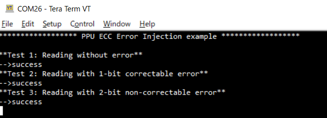

# PROT PPU ECC Error Injection
**This code example shows how to perform the error injection onto Error Correcting Code (ECC) of Peripheral Protection Unit (PPU).**  

## Requirements

- [ModusToolbox&trade;](https://www.infineon.com/modustoolbox) v3.0 or later (tested with v3.0)

## Supported toolchains (make variable 'TOOLCHAIN')

- GNU Arm&reg; Embedded Compiler v11.3.1 (`GCC_ARM`) – Default value of `TOOLCHAIN`

## Device
The device used in this code example (CE) is:
- [TRAVEO™ T2G CYT4BF Series](https://www.infineon.com/cms/en/product/microcontroller/32-bit-traveo-t2g-arm-cortex-microcontroller/32-bit-traveo-t2g-arm-cortex-for-body/traveo-t2g-cyt4bf-series/)

## Board
The board used for testing is:
- TRAVEO™ T2G evaluation kit ([KIT_T2G-B-H_EVK](https://www.infineon.com/evaluation-board/KIT-T2G-B-H-EVK), [KIT_T2G-B-H_LITE](https://www.infineon.com/evaluation-board/KIT-T2G-B-H-LITE))

## Scope of work
The static random-access memory (SRAM) stored protection information of PPU is supported by ECC. This ECC supports single error correction and double error detection (SECDED). In this example, an ECC error is injected into the SRAM that contains PPU configuration.

## Introduction  
**Protection Unit**  
- An address range that is accessed by the transfer
    - Subregion: An address range is partitioned into eight equally-sized subregions and subregion can individual disables
- Access attributes such as:
    - Read/write attribute
    - Execute attribute to distinguish a code access from a data access
    - User/privilege attribute to distinguish access; for example, OS/kernel access from a task/thread access
    - Secure/non-secure attribute to distinguish a secure access from a non-secure access; the Arm Cortex-M CPUs do not
natively support this attribute
    - A protection context attribute to distinguish accesses from different protection contexts; for Peripheral-DMA (P-DMA) and Memory-DMA (M-DMA), this attribute is extended with a channel identifier, to distinguish accesses from different channels
- Memory protection
- Provided by memory protection units (MPUs) and shared memory protection units (SMPUs)
    - MPUs distinguish user and privileged accesses from a single bus master
    - SMPUs distinguish between different protection contexts and between secure and non-secure accesses
- Peripheral protection
    - Provided by peripheral protection units (PPUs)
    - The PPUs distinguish between different protection contexts; they also distinguish secure from non-secure accesses and user mode accesses from privileged mode accesses
- Protection pair structure
- Software Protection Unit (SWPU): SWPUs define flash write (or erase) permissions, and eFuse read and write permissions. An SWPU comprises of the following:
    - Flash Write Protection Unit (FWPU)
    - eFuse Read Protection Unit (ERPU)
    - eFuse Write Protection Unit (EWPU)

More details of TRAVEO™ T2G CYT4BF Series can be found in Technical Reference Manual (TRM), Registers TRM and Data Sheet. (See the [here](https://www.infineon.com/products/microcontroller/32-bit-traveo-t2g-arm-cortex/for-body/t2g-cyt4bf#documents))

## Hardware setup
This CE has been developed for:
- TRAVEO™ T2G evaluation kit ([KIT_T2G-B-H_EVK](https://www.infineon.com/evaluation-board/KIT-T2G-B-H-EVK)) 
 
No changes are required from the board's default settings.

- TRAVEO™ T2G Body High Lite evaluation kit ([KIT_T2G-B-H_LITE](https://www.infineon.com/evaluation-board/KIT-T2G-B-H-LITE)) 
 
No changes are required from the board's default settings.

## Implementation
This CE demonstrates the PPU's feature to inject ECC parity value to verify that the ECC fault operates properly; it consists of three different tests, each generating a no error, 1-bit correctable error, and 2-bit uncorrectable error. The result will be output to the terminal.

**STDOUT setting**

Initialization of the GPIO for UART is done in the <a href="https://infineon.github.io/retarget-io/html/group__group__board__libs.html#gaddff65f18135a8491811ee3886e69707"><i>cy_retarget_io_init()</i></a> function.
- Initialize the pin specified by CYBSP_DEBUG_UART_TX as UART TX, the pin specified by CYBSP_DEBUG_UART_RX as UART RX (these pins are connected to KitProg3 COM port)
- The serial port parameters are set to 8N1 and 115200 baud

**ECC error injection**

- At first, this CE clears the fault status by calling <a href="https://infineon.github.io/mtb-pdl-cat1/pdl_api_reference_manual/html/group__group__sysfault__functions.html#ga0a2a097b9b1d69fb51806964639c7af7"><i>Cy_SysFault_ClearStatus()</i></a>. Then enable capturing PPU ECC faults by calling <a href="https://infineon.github.io/mtb-pdl-cat1/pdl_api_reference_manual/html/group__group__sysfault__functions.html#gafb1516898b15bdc985a7460c7a9f7ca1"><i>Cy_SysFault_SetMaskByIdx()</i></a>.
- In each test, the parity value is calculated based on the value and address of testing target attribute. The calculation is done by the function *generate_Parity()*. See [TRM](https://www.infineon.com/products/microcontroller/32-bit-traveo-t2g-arm-cortex/for-body/t2g-cyt4bf#documents) for details on how parity is calculated.
- The fault status as a parity injection result is confirmed by <a href="https://infineon.github.io/mtb-pdl-cat1/pdl_api_reference_manual/html/group__group__sysfault__functions.html#ga709ec3b6d64ecd3ca0fc712715f66b7e"><i>Cy_SysFault_GetErrorSource()</i></a>.

**LED control**

This CE blinks the user LED if all the tests are successfully finished.
Initialization of the GPIO port pin is done once in the <a href="https://infineon.github.io/mtb-hal-cat1/html/group__group__hal__gpio.html#gab93322030909d3af6a9fc1a3b2eccbaa"><i>cyhal_gpio_init()</i></a> function.
- Initialize the pin specified by *CYBSP_USER_LED1* as output (initial level = H, LED turns off)

The GPIO is controlled when a fault occurs as a *handle_Fault_IRQ* interrupt.
- The user LED blinks three times with a period of 500 ms, whose level is inverted by <a href="https://infineon.github.io/mtb-hal-cat1/html/group__group__hal__gpio.html#gacf9c6cb7d4f6f25828a62d44648b745d"><i>cyhal_gpio_toggle()</i></a> and the interval is created by <a href="https://infineon.github.io/mtb-hal-cat1/html/group__group__hal__system.html#ga5f450769c1207d98134a9ced39adfdda"><i>cyhal_system_delay_ms()</i></a>.

## Run and Test
For this example, a terminal emulator is required to display outputs and receive keys pressed. You can install a terminal emulator if you do not have one. In this example, [Tera Term](https://teratermproject.github.io/index-en.html) was used as the terminal emulator.

After code compilation, perform the following steps to flash the device:
1. Connect the board to your PC using the provided USB cable through the KitProg3 USB connector.
2. Open a terminal program and select the KitProg3 COM port. Set the serial port parameters to 8N1 and 115200 baud.
3. Program the board using one of the following:
    - Select the code example project in the Project Explorer.
    - In the **Quick Panel**, scroll down, and click **[Project Name] Program (KitProg3_MiniProg4)**.
4. After programming, the code example starts automatically. Confirm that the messages are displayed on the UART terminal.
    - *Terminal output on program startup*  
5. You can debug the example to step through the code. In the IDE, use the **[Project Name] Debug (KitProg3_MiniProg4)** configuration in the **Quick Panel**. For details, see the "Program and debug" section in the [Eclipse IDE for ModusToolbox™ software user guide](https://www.infineon.com/MTBEclipseIDEUserguide).

**Note:** **(Only while debugging)** On the CM7 CPU, some code in *main()* may execute before the debugger halts at the beginning of *main()*. This means that some code executes twice: once before the debugger stops execution, and again after the debugger resets the program counter to the beginning of *main()*. See [KBA231071](https://community.infineon.com/t5/Knowledge-Base-Articles/PSoC-6-MCU-Code-in-main-executes-before-the-debugger-halts-at-the-first-line-of/ta-p/253856) to learn about this and for the workaround.

## References  
Relevant Application notes are:
- [AN235305](https://www.infineon.com/assets/row/public/documents/10/42/infineon-an235305-getting-started-with-traveo-t2g-family-mcus-in-modustoolbox-applicationnotes-en.pdf?fileId=8ac78c8c8b6555fe018c1fddd8a72801) - GETTING STARTED WITH TRAVEO™ T2G FAMILY MCUS IN MODUSTOOLBOX™
- [AN219843](https://www.infineon.com/gated/infineon-an219843---protection-configuration-in-traveo-tm-t2g-applicationnotes-en_32a66c38-76fc-478e-ba27-0fccba2b2976) - Protection configuration in TRAVEO™ T2G MCU

ModusToolbox™ is available online:
- <https://www.infineon.com/modustoolbox>

Associated TRAVEO™ T2G MCUs can be found on:
- <https://www.infineon.com/cms/en/product/microcontroller/32-bit-traveo-t2g-arm-cortex-microcontroller/>

More code examples can be found on the GIT repository:
- [TRAVEO™ T2G Code examples](https://github.com/orgs/Infineon/repositories?q=topic%3Akit-t2g-b-h-lite&type=all&language=&sort=) for [KIT_T2G-B-H_LITE](https://www.infineon.com/evaluation-board/KIT-T2G-B-H-LITE)
- [TRAVEO™ T2G Code examples](https://github.com/orgs/Infineon/repositories?q=topic%3Akit-t2g-b-h-evk&type=all&language=&sort=) for [KIT_T2G-B-H_EVK](https://www.infineon.com/evaluation-board/KIT-T2G-B-H-EVK)

For additional trainings, visit our webpage:  
- [TRAVEO™ T2G trainings](https://www.infineon.com/training/microcontroller-trainings)

For questions and support, use the TRAVEO™ T2G Forum:  
- <https://community.infineon.com/t5/TRAVEO-T2G/bd-p/TraveoII>  